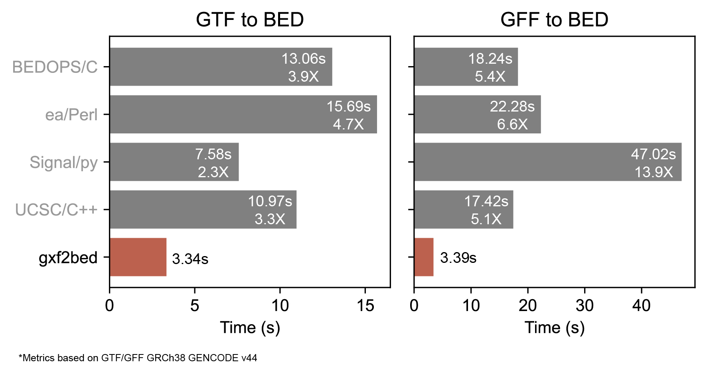

# gxf2bed
The fastest G{F,T}F-to-BED converter around the block! 

translates

```
chr27 gxf2bed gene 17266470 17285418 . + . gene_id "ENSG00000151743";

chr27 gxf2bed transcript 17266470 17281218 . + . gene_id "ENSG00000151743"; transcript_id "ENST00000541931.8";

chr27 gxf2bed exon 17266470 17266572 . + . gene_id "ENSG00000151743"; transcript_id "ENST00000541931.8"; exon_number "1"; exon_id "ENST00000541931.8.1";

...
```
into

```
chr27 17266469 17281218 ENST00000541931.8 1000 + 17266469 17281218 0,0,200 2 103,74, 0,14675,
```
before your eyes blink!


Converts
- *Homo sapiens* GRCh38 GENCODE 44 (252,835 transcripts) in 2.99 seconds.
- *Mus musculus* GRCm39 GENCODE 44 (149,547 transcritps) in 1.91 seconds.
- *Canis lupus familiaris* ROS_Cfam_1.0 Ensembl 110 (55,335 transcripts) in 0.95 seconds. 
- *Gallus galus* bGalGal1 Ensembl 110 (72,689 transcripts) in 1.07 seconds.

> What's new on v.0.2.1
>
> - Fixes some rare GTF bugs due to extra '\n' at the end (malformed GTFs)
> - Adds test modules for record parsing and attr parsing
> - Build a nextflow module! Thanks to [@edmundmiller](https://github.com/edmundmiller)!
> - Updates run times. Now `gxf2bed` is faster (~0.7s +/-0.2s) due to a change in the hashing algo (now using hashbrown)!


## Usage
``` rust
Usage: gxf2bed[EXE] --input/-i <GTF/GFF> --output/-o <BED> [--parent/-p <PARENT>] [--child/-c <CHILD>] [--feature/-f <FEATURE>]
 
Arguments:
    --input/-i <GTF/GFF>: a .gtf/.gff file
    --output/-o <BED>: path to output .bed file
    --parent/-p <PARENT>: parent node [default: "transcript"]
    --child/-c <CHILD>: child node [default: "exon"]
    --feature/-f <FEATURE>: feature to extract from the attribute line [default: "transcript_id"]

Options:
    --help: print help
    --version: print version
    --threads/-t: number of threads (default: max ncpus)
```

## Installation
to install gxf2bed on your system follow this steps:
1. get rust: `curl https://sh.rustup.rs -sSf | sh` on unix, or go [here](https://www.rust-lang.org/tools/install) for other options
2. run `cargo install gxf2bed` (make sure `~/.cargo/bin` is in your `$PATH` before running it)
4. use `gxf2bed` with the required arguments
5. enjoy!

## Build
to build gxf2bed from this repo, do:

1. get rust (as described above)
2. run `git clone https://github.com/alejandrogzi/gxf2bed.git && cd gxf2bed`
3. run `cargo run --release -- -i <GTF/GFF> -o <BED>`

## Container image
to build the development container image:
1. run `git clone https://github.com/alejandrogzi/gxf2bed.git && cd gxf2bed`
2. initialize docker with `start docker` or `systemctl start docker`
3. build the image `docker image build --tag gxf2bed .`
4. run `docker run --rm -v "[dir_where_your_gtf_is]:/dir" gxf2bed -i /dir/<GTF/GFF> -o /dir/<BED>`

## Conda
to use gxf2bed through Conda just:
1. `conda install gxf2bed -c bioconda` or `conda create -n gxf2bed -c bioconda gxf2bed`


## Benchmark + FAQ
<p align="center">
    
</p>

If you google "gtf to bed" or "gff to bed" you'll find some posts about recommended tools. Part of these tools are already deprecated or too difficult to run (even in Linux), due to poor maintenance. This project was conceived to provide an easy way to convert GTF/GFF files to BED structures and finish a set of high-performance converters between gene model formats in Rust (bed2gtf, bed2gff and now gxf2bed). 

To test the efficiency of gxf2bed, I took 4 GTF/GFF-to-BED converters and ran them with the current GRCh38 GENCODE annotation (v.44), that has ~250,000 transcripts [the values showed here are the mean of 5 consecutive runs]. Briefly, the competitors are:
- UCSC's utils: `gtfToGenePred | genePredToBed` & `gffToGenePred | genePredToBed` (taken from [here](https://hgdownload.soe.ucsc.edu/admin/exe/linux.x86_64/))
- Signal & Brown: `gtf2bed.py` & `gff32gtf.py && gtf2bed.py` (taken from [here](https://github.com/signalbash/how_are_we_stranded_here/tree/master/how_are_we_stranded_here))
- ea-utils: `gtf2bed.pl` & `gff2gtf.pl | gtf2bed.pl` (taken from [here](https://github.com/ExpressionAnalysis/ea-utils/tree/master/clipper))
- BEDOPS: `gtf2bed` &  `gtf2bed` (taken from [here](https://github.com/bedops/bedops/tree/master/applications/bed/conversion/src/wrappers)) 

Besides the easy way to make `gxf2bed` run and the GFF-GTF channel that allows centralize both in a single converter, this tool showed a significant difference in computation time against the other tools in each one of the two formats. Even using a combination of different number of threads, times were practically the same 3.5s +/- 0.4s and the differences were maintained. Is important to note that GFF3 files took a lot more time than its GTF counterpart. This could be due to the need of chaining two different programs 1) GFF-to-GTF and 2) GTF-to-BED.

Taken together, `gxf2bed` offers an easier and faster way to convert GTF/GFF files to BED files. This tool could save you at least x2-3 times the time you used to spend using other tools to convert GTF files and x5 times if you want to convert GFF3 files!


